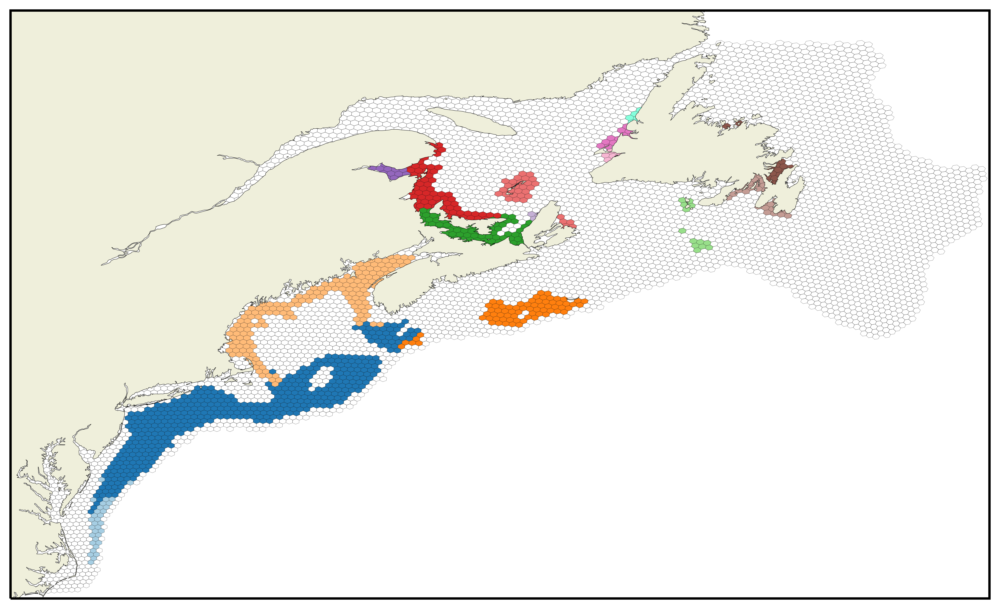

# Assessing spatial structure in marine populations



This repository contains code used for assessing spatial structure in marine populations. This research was conducted with [Dalhousie University](https://www.dal.ca)'s Department of Engineering Mathematics & Internetworking in collaboration with [Fisheries and Oceans Canada](https://www.dfo-mpo.gc.ca). Author is Karsten Economou.

## About the research

Manuscript in progress.

## Data used

The particle-track simulation, contributed to by Dr. Kira Krumhansl, Dr. Wendy Gentleman, and Karsten Economou (not included in this repository), uses the Bedford Institute of Oceanography North Atlantic Ocean model (BNAM) for field data. The species distribution model used for *Placopecten magellanicus* was provided by Drs. Ben Lowen and Claudio DiBacco.

## Usage

See `LICENSE`.

### Installation

All `.py` and `.ipynb` files are written in Python 3.8.

Clone the repository with

```shell
git clone https://github.com/KarstenEconomou/marine-spatial-structure
```

or use [DownGit](https://minhaskamal.github.io/DownGit/#/home?url=https://github.com/KarstenEconomou/marine-spatial-structure) to download the files.

Install requirements with a virtual environment (venv) activated with

```shell
pip install -r requirements.txt
```

### File structure

Used data, temporary files, and most output is not included in this repository. `pathlib` is used for referencing files in code with the `cwd` assumed to be the top-level project directory.

## Main pipeline

### Pre-simulation

1. Create initial particle locations of a uniform density: `initial_positions.ipynb`
2. Write a grid over the domain depicting the suitability of habitat of each cell for each genetic lineage from a `.tif` probability-based species distribution model: `sdm_grid.ipynb`

### Post-simulation

1. Process simulated particle trajectories and create a flow network: `network.ipynb`
2. Run *Infomap*: `community_detection.ipynb`
3. Plot and analyze detected communities stored in `.clu` format: `modules.ipynb`

### Utilities

* `plot.py` offers tailored options for plotting particles and hexagons over the domain of interest
* `constants.py` is a centralized hub of constants
* `geneticlineage.py`, `hexbin.py`, `module.py`, `particle.py`, `particletype.py`, `season.py`, `zone.py` are modules containing classes.
