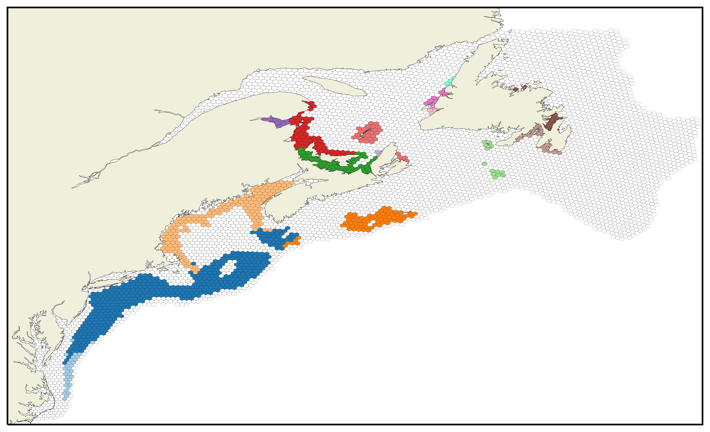

# Assessing spatial structure in marine populations

This research was conducted with [Dalhousie University](https://www.dal.ca)'s Department of Engineering Mathematics & Internetworking in collaboration with [Fisheries and Oceans Canada](https://www.dfo-mpo.gc.ca). Author is Karsten Economou.

Manuscript in progress.

## Usage

See `LICENSE`.

## Main pipeline

### Pre-simulation

1. Create initial particle locations of a uniform density: `initial_positions.ipynb`
2. Write a grid over the domain depicting the suitability of habitat of each cell for each genetic lineage from a `.tif` probability-based species distribution model: `sdm_grid.ipynb`

### Post-simulation

1. Process simulated particle trajectories and create a flow network: `network.ipynb`
2. Run *Infomap*: `community_detection.ipynb`
3. Plot and analyze detected communities stored in `.clu` format: `modules.ipynb`

### Utilities

* `plot.py` offers tailored options for plotting particles and hexagons over the domain of interest
* `constants.py` is a centralized hub of constants
* `geneticlineage.py`, `hexbin.py`, `module.py`, `particle.py`, `particletype.py`, `season.py`, `zone.py` are modules containing classes.
